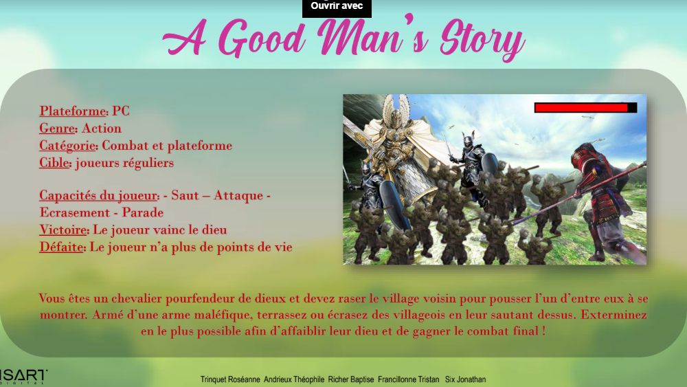
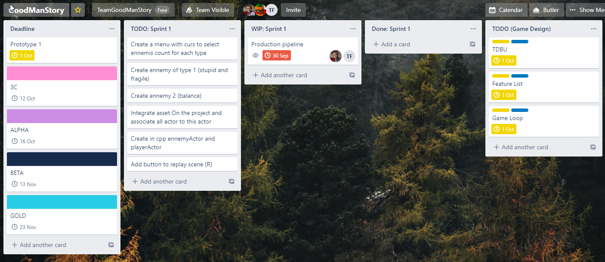

#Pipeline de Production 

##Groupe:
- GD:
    - ANDRIEUX Théophile (Porte-parole)
    - RICHER Baptiste
    - TRINQUET Roséanne
- GP:
    - SIX Jonathan
    - FRANCILLONNE Tristan (Porte-parole)

##Présentation du projet:
Vous êtes un chevalier venu tuer un dieu protecteur éliminez le plus de villageois pour gagner en puissance 

##Communication:
Chanel textuel et vocal commun entre gd et gp(Projet-11) sur discord dans le groupe GD2 (lien d’invitation https://discord.gg/ApGRaA)

Dailymeeting tous les matins à 9h30 dans la cours d’Isart digital pour faire un point sur l'avancée du projet et les tâche en cours.

##Versionning:
utilisation de git sur sourcetree
architecture du git par feature (tasks)
commit régulier mais faire des merges uniquement lorsque la feature est terminée 
Le gitignore ne push pas les Contents/Assets. Ils sont donc a ajouter a depuis le drive.
Dans le drive 2 type de Contents/Assets sont presente : Celle des sprints avec des assets allege et celui du projet avec toutes les assets meme non utilise (03_Assets (interne)). Lors d'une modification sur une asset, c'est celui ci qui doit etre mis a jour.
Dans le trello, les bluprints touche par un ticket doivent etre indique. Ainsi lorsque quelque trqvqil sur un blueprint, il DOIT ETRE LE SEUL. Les conflict sont mal gere avec des binaire et ecrase les autre version. Il faut donc etre tres ascidu sur cette regle pour eviter de supprimer le travail de quelau'un d'autre.

Repo : ssh://git@git.isartintra.com:2424/2020/GP_GD_2024Brawler3D/GoodManStory.git

##Outils de travail:
raider avec setting commun pour le formatage et la mise en forme (faire régulièrement ctrl + alt + enter pour formater et save après ctrl + S)
Respecter le coding style d'Unreal pour le nommage des variables : https://docs.unrealengine.com/en-US/Programming/Development/CodingStandard/index.html
utilisation de la version 4.24.3 d’unreal engine

Organisation de Projet:
architecture du projet: toutes les blueprints(BPA,BB,BT) dans contents/blueprints et toutes les assets dans content/assets

lien du drive:
https://drive.google.com/drive/folders/1ojFCvdeoNRP3chNNCs8jBwAU2MrhgaWo

build jeudi après-midi toutes les semaines (méthode Agile)
rendu de build toutes les deux semaines vendredi 17h max avec CHANGELOG sur le drive
Chaque sprint serront organise le vendredi apres-midi
exemble: Projet_11/00_Livrables/Builds/Sprint_**{00}**/   (numero du sprint indiquer dans les accolades)

dans 01_Production  mettre dans le dossier content uniquement lors des rendu de build avec la même nomenclature indique juste ci-dessus
exemble: Projet_11/01_Production /Sprint_**{00}**/Content/...
(numéro du sprint indiquer dans les accolades)

mettre dans le document Closing_Kit les éléments relatifs au game design

##Planification:
logiciel utilise Trello

Date cle a indiquer dans la deadline. pour vous ajouter demander à l’admin